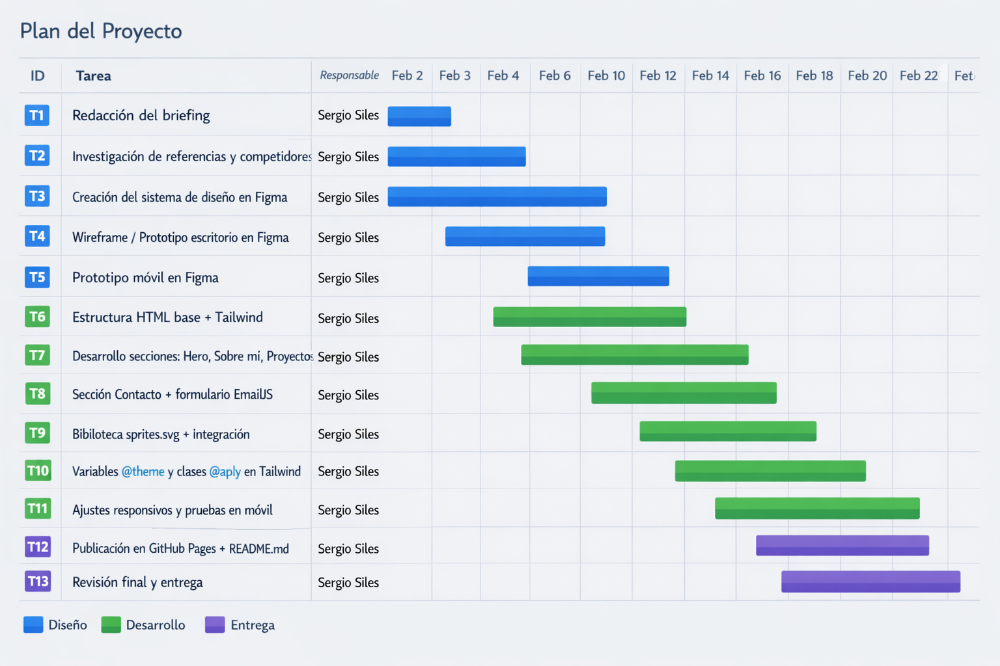

# Análisis y Planificación – Portfolio Sergio Siles

## 1. Objetivos Principales (SMART)

Los objetivos son específicos, medibles y limitados en tiempo:

| #   | Objetivo                                                                          | Indicador                      | Plazo      |
| --- | --------------------------------------------------------------------------------- | ------------------------------ | ---------- |
| O1  | Diseñar el prototipo completo en Figma (escritorio + móvil) con sistema de diseño | Prototipo publicado y enlazado | Semana 1   |
| O2  | Desarrollar la web funcional con HTML + Tailwind CSS 4 (responsiva)               | Site accesible localmente      | Semana 2-3 |
| O3  | Integrar sprites SVG, variables `@theme` y clases `@apply`                        | Criterios de rúbrica cumplidos | Semana 3   |
| O4  | Publicar el portfolio en GitHub Pages con README completo                         | URL pública accesible          | Semana 4   |

---

## 2. Desglose de Tareas

| ID  | Tarea                                            | Responsable  | Inicio     | Fin        |
| --- | ------------------------------------------------ | ------------ | ---------- | ---------- |
| T1  | Redacción del briefing                           | Sergio Siles | 03/02/2026 | 03/02/2026 |
| T2  | Investigación de referencias y competidores      | Sergio Siles | 03/02/2026 | 04/02/2026 |
| T3  | Creación del sistema de diseño en Figma          | Sergio Siles | 04/02/2026 | 06/02/2026 |
| T4  | Wireframe / Prototipo escritorio en Figma        | Sergio Siles | 06/02/2026 | 08/02/2026 |
| T5  | Prototipo móvil en Figma                         | Sergio Siles | 08/02/2026 | 09/02/2026 |
| T6  | Estructura HTML base + Tailwind                  | Sergio Siles | 10/02/2026 | 12/02/2026 |
| T7  | Desarrollo secciones: Hero, Sobre mí, Proyectos  | Sergio Siles | 12/02/2026 | 17/02/2026 |
| T8  | Sección Contacto + formulario EmailJS            | Sergio Siles | 17/02/2026 | 19/02/2026 |
| T9  | Biblioteca sprites.svg + integración             | Sergio Siles | 19/02/2026 | 20/02/2026 |
| T10 | Variables `@theme` y clases `@apply` en Tailwind | Sergio Siles | 20/02/2026 | 21/02/2026 |
| T11 | Ajustes responsivos y pruebas en móvil           | Sergio Siles | 21/02/2026 | 23/02/2026 |
| T12 | Publicación en GitHub Pages + README.md          | Sergio Siles | 24/02/2026 | 25/02/2026 |
| T13 | Revisión final y entrega                         | Sergio Siles | 26/02/2026 | 27/02/2026 |

---

## 3. Diagrama de Gantt

---

## 4. Herramientas de Software Utilizadas

| Herramienta               | Uso                                        | Fase                 |
| ------------------------- | ------------------------------------------ | -------------------- |
| **Figma**                 | Diseño, sistema de diseño, prototipos      | Diseño y prototipado |
| **VS Code**               | Editor de código principal                 | Desarrollo           |
| **Tailwind CSS 4**        | Framework CSS (vía CLI)                    | Desarrollo           |
| **pnpm**                  | Gestor de paquetes                         | Desarrollo           |
| **GitHub / GitHub Pages** | Control de versiones y publicación         | Publicación          |
| **EmailJS**               | Servicio de envío de emails desde frontend | Desarrollo           |
| **Google Fonts**          | Tipografía "Press Start 2P"                | Diseño / Desarrollo  |
| **SVG Sprite Generator**  | Creación de la biblioteca sprite.svg       | Desarrollo           |
