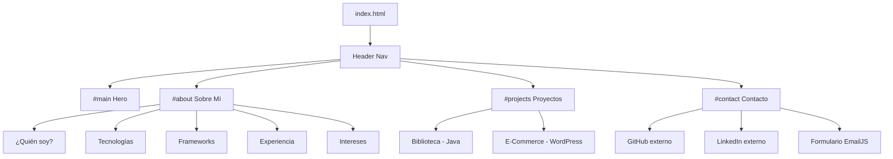

# Mapa del Sitio – Portfolio Sergio Siles

## Estructura de Navegación

El portfolio es una **Single Page Application (SPA)** con navegación mediante anclas. Todas las secciones residen en el mismo `index.html`.

```
📄 index.html (Página Principal)
│
├── 🏠 Header (Navegación fija)
│   ├── Logo / Nombre  →  #main (scroll al inicio)
│   ├── Sobre mí       →  #about
│   ├── Proyectos      →  #projects
│   └── Contacto       →  #contact
│
├── 🎯 #main (Hero / Inicio)
│   ├── Foto de perfil / Ilustración
│   ├── Nombre animado (efecto wave neon)
│   └── Descripción corta
│
├── 👤 #about (Sobre Mí)
│   ├── ¿Quién soy?       (tarjeta retro)
│   ├── Tecnologías        (badges: HTML, CSS, JS, Python, Java, SQL)
│   ├── Frameworks         (badges: React, Tailwind, JDBC, JPA)
│   ├── Experiencia        (lista: BEEP, OutSystems)
│   └── Intereses          (badges: Backend, BigData, IA, Ciberseguridad)
│
├── 💼 #projects (Proyectos)
│   ├── Proyecto 1: Biblioteca  (Java, JDBC, JPA, SQL) — Completado
│   └── Proyecto 2: E-Commerce  (WordPress, CSS)       — En desarrollo
│
└── 📬 #contact (Contacto)
    ├── Tarjeta de redes sociales
    │   ├── GitHub   →  https://github.com/SergioSiles  [enlace externo]
    │   └── LinkedIn →  https://linkedin.com/...         [enlace externo]
    └── Formulario de contacto
        ├── Campo: Nombre
        ├── Campo: Email
        ├── Campo: Mensaje
        └── Botón: Enviar (vía EmailJS)
```

---

## Recursos Externos

| Recurso         | URL                                                                  |
| --------------- | -------------------------------------------------------------------- |
| GitHub          | https://github.com/SergioSiles                                       |
| LinkedIn        | https://www.linkedin.com/in/sergio-siles-gomez-277104278/            |
| Prototipo Figma | https://www.figma.com/design/xz0WDbHxAzLEPwLMG3Ymsx/Portfolio?m=draw |
| GitHub Pages    | https://sergiosiles.github.io/PortFolio/                             |

---

## Mapa Visual (Diagrama)


